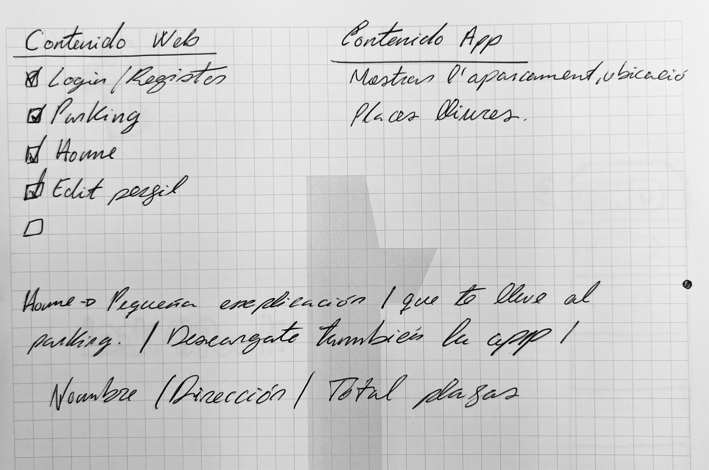
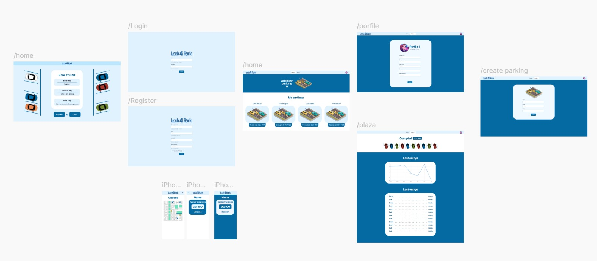
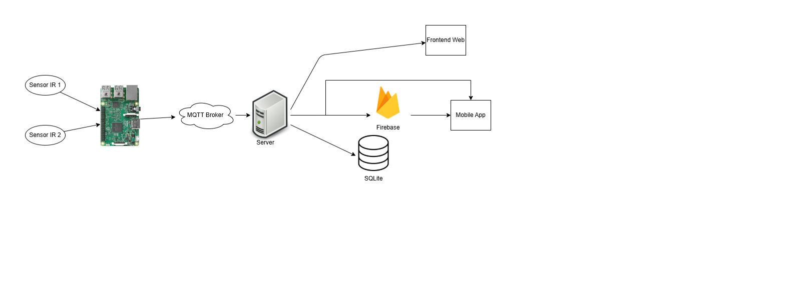
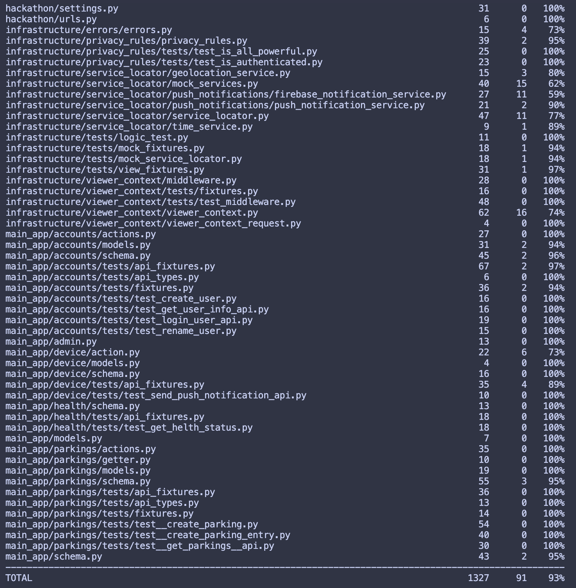

### **Lo que hace**

La aplicación es un sistema integrado de monitoreo de aparcamientos que permite a los administradores gestionar los aparcamientos públicos y a los usuarios finales visualizar en tiempo real los espacios disponibles, notificaciones sobre ocupación, y la creación de nuevos aparcamientos mediante una plataforma intuitiva. Además, incorpora un sistema de predicción basado en inteligencia artificial que ayuda a los administradores a anticipar el uso de sus aparcamientos.

### **Cómo lo construimos**

Para construir la aplicación, la dividimos en cuatro componentes principales:

**1. Sensorización y hardware:**
Desarrollamos scripts que recolectan datos en tiempo real sobre las entradas y salidas de los vehículos en los aparcamientos públicos. Estos datos se transmiten a través de un sistema MQTT que distribuye la información hacia los módulos correspondientes.

**2. Backend y procesamiento:**
Creamos un backend centralizado que recibe y procesa los datos transmitidos por MQTT. Este backend almacena los registros históricos y actualiza un estado en tiempo real. También implementamos endpoints para gestionar datos administrativos y consultas de los usuarios.

**3. Predicción con IA:**
Integramos un modelo de aprendizaje automático que analiza los patrones históricos de ocupación y otros factores, como horas pico y eventos locales, para predecir el uso futuro de los aparcamientos. Esta herramienta permite a los administradores tomar decisiones proactivas, optimizar la capacidad y mejorar la experiencia de los usuarios finales.

**4. Aplicación web y móvil:**

- **Web:** Una plataforma administrativa diseñada para que los operadores puedan dar de alta nuevos aparcamientos, configurar sus parámetros, visualizar datos históricos y en tiempo real, y acceder a las predicciones generadas por la IA.
- **Móvil:** Una aplicación multiplataforma que permite a los usuarios finales localizar plazas de aparcamiento disponibles, ver la cantidad de plazas libres, recibir alertas sobre disponibilidad, y consultar información relevante sobre el estado de los aparcamientos.

### **Entorno de desarrollo**

Para el desarrollo, utilizamos:

- **Frontend:** Typescript y React, estilizado con Tailwind CSS.
- **Backend:** Un sistema basado en Node.js y Prisma como ORM para interactuar con PostgreSQL.
- **Multiplataforma móvil:** Flutter para soportar Android e iOS.
- **Mensajería en tiempo real:** MQTT para transmitir datos de sensores.
- **Inteligencia Artificial:** TensorFlow y Scikit-learn para entrenar y desplegar el modelo predictivo.
- **Infraestructura en la nube:** AWS para el despliegue, procesamiento y almacenamiento de datos.

### **Desafíos que enfrentamos**

La integración de un sistema de sensorización en tiempo real con una arquitectura web y móvil, junto con la implementación de un sistema de mensajería MQTT y un modelo de inteligencia artificial predictivo, fue un reto técnico significativo. Ajustar el modelo de IA para garantizar predicciones precisas y útiles en entornos con datos limitados o inconsistentes presentó un desafío adicional.

### **Logros de los que estamos orgullosos**

Hemos desarrollado un sistema funcional, escalable y enriquecido con inteligencia artificial que conecta eficientemente hardware y software para resolver una necesidad clave en la administración de aparcamientos. La capacidad de predicción es una herramienta clave que optimiza la gestión y mejora la experiencia tanto para administradores como para usuarios finales.

### **Próximos pasos para el sistema de monitoreo de aparcamientos**

- **Optimización de rutas:** Incluir recomendaciones personalizadas basadas en las predicciones para redirigir a los usuarios hacia los aparcamientos menos saturados.
- **Integración con ciudades inteligentes:** Explorar colaboraciones para incluir datos externos y hacer que el sistema sea parte de iniciativas de smart cities.

# Proceso de desarrollo

### **1. Diseño y planificación**

Comenzamos con un análisis detallado de los requisitos del sistema y las necesidades de los usuarios. Definimos los casos de uso, los flujos de trabajo y los requisitos funcionales y no funcionales. Luego, diseñamos la arquitectura general del sistema, incluyendo la integración de hardware, el backend, la inteligencia artificial y las aplicaciones web y móviles.

[Design and Planning on Figma](<https://www.figma.com/design/0NueDLPXv7xXIE0AHnryso/%40shadcn%2Fui---Design-System-(Community)?node-id=1-22&node-type=canvas&t=1rKNrBXvWnLKfswo-0>)

### **2. Infraestructura**

La imagen anterior muestra la infraestructura del sistema, incluyendo la integración de sensores, el backend, la inteligencia artificial y las aplicaciones web y móviles. Esta arquitectura asegura una comunicación fluida y eficiente entre todos los componentes del sistema.

### **3. Desarrollo**

#### **Backend**

Usamos una arquitectura de implementacion basada en TDD (Test Driven Development) para garantizar la calidad y la escalabilidad del código. Implementamos endpoints GraphQL para la comunicación con el frontend y MQTT para la comunicación con los sensores. Usamos Django para el backend.

#### **Frontend**

Desarrollamos una interfaz de usuario intuitiva y atractiva para la aplicación web y móvil. Utilizamos React y Tailwind CSS para el frontend web y Flutter para el frontend móvil. La interfaz de usuario se diseñó teniendo en cuenta la facilidad de uso y la accesibilidad.

#### **App móvil**

Desarrollamos una aplicación móvil multiplataforma con Flutter para garantizar una experiencia de usuario consistente en Android e iOS. La aplicación permite a los usuarios finales buscar aparcamientos, ver la disponibilidad en tiempo real y recibir notificaciones sobre la ocupación.
